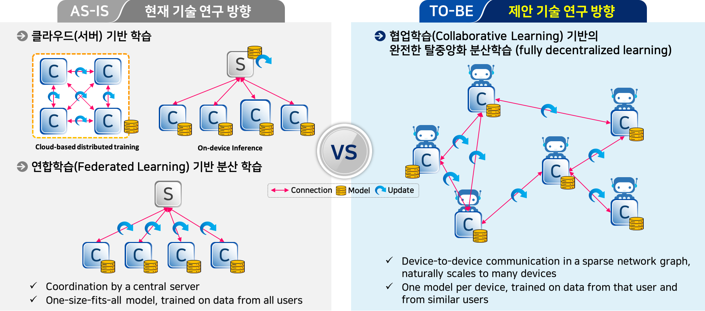

# 협업학습기술 관련연구 
### 수행기관: 한국전자통신연구원

## Summary
In the distributed setting, we study weight update algorithms(like DSGD, ADMM, and Collaborative Learning). This code leads a brief overview of ways in which we can solve this problem. 




## Install
```python
pip install -r requirements.txt
```

## Quickstart
```python
python main.py ./data ./output/ring1 --epochs 200 --batch_size 100 --l2_lambda 0.01 --model_name resnet50 --dataset_name cifar10 --group_channels 32 --drop_rate 0.1 --last_drop_rate 0.5 --loglevel INFO --train_data_length 10000 --cuda_device_no 1 --skip_plots --scheduler StepLR --step_size 410 --gamma 0.9 --sleep_factor 0 DSGD node0 ./conf/node_list.json ./conf/hosts.json --lr 0.002 --swap_timeout 10 --async_step > ./output/ring1/node0.txt
python main.py ./data ./output/ring2 --epochs 200 --batch_size 100 --l2_lambda 0.01 --model_name resnet50 --dataset_name cifar10 --group_channels 32 --drop_rate 0.1 --last_drop_rate 0.5 --loglevel INFO --train_data_length 10000 --cuda_device_no 2 --skip_plots --scheduler StepLR --step_size 410 --gamma 0.9 --sleep_factor 0 DSGD node1 ./conf/node_list.json ./conf/hosts.json --lr 0.002 --swap_timeout 10 --async_step > ./output/ring2/node1.txt 
python main.py ./data ./output/ring3 --epochs 200 --batch_size 100 --l2_lambda 0.01 --model_name resnet50 --dataset_name cifar10 --group_channels 32 --drop_rate 0.1 --last_drop_rate 0.5 --loglevel INFO --train_data_length 10000 --cuda_device_no 3 --skip_plots --scheduler StepLR --step_size 410 --gamma 0.9 --sleep_factor 0 DSGD node2 ./conf/node_list.json ./conf/hosts.json --lr 0.002 --swap_timeout 10 --async_step > ./output/ring3/node2.txt 
```
```python
   optim_args = {}
    if args.optimizer == "sgd":
        optim_args["lr"] = args.lr
        optim_args["momentum"] = args.momentum
        optim_args["weight_decay"] = args.weight_decay
        optim_args["dampening"] = args.dampening
        optim_args["nesterov"] = args.nesterov
    elif args.optimizer == "adam":
        optim_args["lr"] = args.lr
        optim_args["betas"] = args.betas
        optim_args["eps"] = args.eps
        optim_args["weight_decay"] = args.weight_decay
        optim_args["amsgrad"] = args.amsgrad
    elif args.optimizer == "DSGD":
        optim_args["lr"] = args.lr
        optim_args["momentum"] = args.momentum
        optim_args["weight_decay"] = args.weight_decay
        optim_args["dampening"] = args.dampening
        optim_args["nesterov"] = args.nesterov
        optim_args["weight"] = args.weight
        optim_args["round_step"] = args.round_step
        optim_args["swap_timeout"] = args.swap_timeout
    elif args.optimizer == "GossipSGD":
        optim_args["lr"] = args.lr
        optim_args["momentum"] = args.momentum
        optim_args["weight_decay"] = args.weight_decay
        optim_args["dampening"] = args.dampening
        optim_args["nesterov"] = args.nesterov
        optim_args["weight"] = args.weight
        optim_args["round_step"] = args.round_step
        optim_args["swap_timeout"] = args.swap_timeout
    elif args.optimizer == "AdmmSGD":    
        optim_args["lr"] = args.lr
        optim_args["mu"] = args.mu
        optim_args["eta"] = args.eta
        optim_args["rho"] = args.rho
        optim_args["drs"] = True
        optim_args["round_step"] = args.round_step
        optim_args["swap_timeout"] = args.swap_timeout
    elif args.optimizer == "PdmmSGD":    
        optim_args["lr"] = args.lr
        optim_args["mu"] = args.mu
        optim_args["eta"] = args.eta
        optim_args["rho"] = args.rho
        optim_args["drs"] = False
        optim_args["round_step"] = args.round_step
        optim_args["swap_timeout"] = args.swap_timeout
    elif args.optimizer == "PdmmISVR":    
        optim_args["lr"] = args.lr
        optim_args["round_step"] = args.round_step
        optim_args["use_gcoef"] = args.use_gcoef
        optim_args["drs"] = False
        optim_args["piw"] = args.piw
        optim_args["swap_timeout"] = args.swap_timeout
    elif args.optimizer == "AdmmISVR":   
        optim_args["lr"] = args.lr
        optim_args["round_step"] = args.round_step
        optim_args["use_gcoef"] = args.use_gcoef
        optim_args["drs"] = True
        optim_args["piw"] = args.piw
        optim_args["swap_timeout"] = args.swap_timeout
```

## Distributed Deep Learing: From Single-Node to P2P(Peer-to-Peer)

### Single-Node Training (with SGD)
> Ex.) Basic optimizer codes <br>
```python
 loss_fn = nn.CrossEntropyLoss() 
 optimizer = optim.SGD(model.parameters(), lr=0.01, momentum=0.9) 
 for t in ragne(epochs):
    for batch, (X,y) in enumerate(dataloader): 
       pred = model(X) 
       loss = loss_fn(pred,y) 
       optimizer.zero_grad() 
       loss.backward() 
       optimizer.step() 
```
> Ex.) Stochastic Gradient Descent(SGD) <br>
```python
     # optimizer.step()
     # W = W - lr * dl/dW 
     for group in param_groups: 
        for i, param in enumerate(group['params']): 
           param.add_(param.grad, alpha=-lr)
```

```python
epoch,   train_loss,    val_loss,    test_loss,    train_acc,     val_acc,     test_acc
1,            2.616,       2.192,        2.191,        0.173,       0.178,        0.175
...
200,          0.311,       0.187,        0.998,        0.942,       0.939,      [ 0.721 ]
```

### P2P(Peer-to-Peer) Training (with D-SGD)
> Ex.) Decentralized Stochastic Gradient Descent(D-SGD) <br>
```python
     for group in param_groups: 
        for i, param in enumerate(group['params']): 
           param.add_(param.grad, alpha=-lr)

           ############################################
           param_sum = torch.zeros_like(param)
           param_sum += param.data
           for edge in edges:
               param_sum += edge.prm_state["rcv"][i]
           param.data = param_sum / edge_num
           for edge in edges:
               edge.prm_state["snd"][i] = param.data
           ###########################################
```
 
```python
(Node-1)
epoch,   train_loss,    val_loss,    test_loss,    train_acc,     val_acc,     test_acc
1,            2.560,       2.417,        2.415,        0.142,       0.111,        0.118
...
200,           1.761,      1.617,        1.630,        0.465,       0.424,      [ 0.416 ]  
(Node-2)
epoch,   train_loss,    val_loss,    test_loss,    train_acc,     val_acc,     test_acc
1,            2.580,       2.349,        2.349,        0.186,       0.148,        0.145
...
200,          1.654,       1.624,        1.632,        0.462,       0.426,      [ 0.421 ]
(Node-3)
epoch,   train_loss,    val_loss,    test_loss,    train_acc,     val_acc,     test_acc
1,            2.555,       2.389,        2.390,        0.186,       0.121,        0.119
...
100,          1.632,       1.687,        1.701,        0.490,       0.406,      [ 0.405 ]  
...
200,
```

### P2P(Peer-to-Peer) Training (with Gossip SGD)
> Ex.) Gossip Stochastic Gradient Descent(Gossip SGD) <br>
```python
     for edge in edges:
         for group in param_groups: 
            for i, param in enumerate(group['params']): 
               ############################################
               param.data = torch.div( (param.data + edge.prm_state["rcv"][i] ), 2 ) 
               edge.prm_state["snd"][i] = param.data
               ###########################################
```

```python
(Node-1) 
epoch,   train_loss,    val_loss,    test_loss,    train_acc,     val_acc,     test_acc
1,            2.574,       2.467,        2.467,        0.192,       0.120,        0.121
...
198,          1.489,       1.620,        1.637,        0.480,       0.435,      [ 0.433 ]                     
(Node-2)
epoch,   train_loss,    val_loss,    test_loss,    train_acc,     val_acc,     test_acc
1,            2.643,       2.443,        2.444,        0.153,       0.107,        0.107   
...
200,          1.423,       1.445,        1.463,        0.536,       0.489,      [ 0.486 ]    
(Node-3)
epoch,   train_loss,    val_loss,    test_loss,    train_acc,     val_acc,     test_acc
1,            2.546,       2.392,        2.392,        0.252,       0.160,        0.154   
...
89,           1.438,       1.471,        1.500,        0.534,       0.485,      [ 0.477 ]
...
200           
```

### P2P(Peer-to-Peer) Training (with ADMM SGD) 
```python
(Node-1) 
epoch,   train_loss,    val_loss,    test_loss,    train_acc,     val_acc,     test_acc
1,            2.770,       2.907,        2.906,        0.099,       0.100,        0.100     
...
200,                 
(Node-2)
epoch,   train_loss,    val_loss,    test_loss,    train_acc,     val_acc,     test_acc
1,            2.655,       2.931,        2.931,        0.123,       0.121,        0.122     
...
200,             
(Node-3)
epoch,   train_loss,    val_loss,    test_loss,    train_acc,     val_acc,     test_acc
1,            2.860,       2.697,        2.697,        0.156,       0.100,        0.100       
...
84,           
...
200
```

### P2P(Peer-to-Peer) Training (with PDMM SGD)
```python
(Node-1) 
epoch,   train_loss,    val_loss,    test_loss,    train_acc,     val_acc,     test_acc
1,            2.315,       2.366,        2.364,        0.169,       0.118,        0.120
...
199,          0.992,       0.866,        1.050,        0.673,       0.701,      [ 0.651 ]       
(Node-2)
epoch,   train_loss,    val_loss,    test_loss,    train_acc,     val_acc,     test_acc
1,            2.311,       2.336,        2.338,        0.147,       0.105,        0.103
...
200,          0.886,       0.790,        0.991,        0.715,       0.726,      [ 0.667 ]   
(Node-3)
epoch,   train_loss,    val_loss,    test_loss,    train_acc,     val_acc,     test_acc
1,            2.290,       2.493,        2.494,        0.227,       0.144,        0.145 
...
84,           0.857,       0.833,        1.026,        0.741,       0.713,      [ 0.655 ]
...
200
```

### P2P(Peer-to-Peer) Training (with ADMM ISVR)
```python
(Node-1) 
epoch,   train_loss,    val_loss,    test_loss,    train_acc,     val_acc,     test_acc
1,            2.512,       2.436,        2.431,        0.180,       0.118,        0.119
...
200,          1.655,       1.246,        1.300,        0.585,       0.580,      [ 0.562 ]    
(Node-2)
epoch,   train_loss,    val_loss,    test_loss,    train_acc,     val_acc,     test_acc
1,            2.419,       2.319,        2.320,        0.210,       0.157,        0.155
...
200,          0.891,       0.951,        1.125,        0.688,       0.671,      [ 0.623 ]
(Node-3)
epoch,   train_loss,    val_loss,    test_loss,    train_acc,     val_acc,     test_acc
1,            2.463,       2.510,        2.511,        0.178,       0.113,        0.115
...
85,           1.776,       1.225,        1.278,        0.641,       0.562,      [ 0.547 ] 
...
200
```

### P2P(Peer-to-Peer) Training (with PDMM ISVR)
```python
(Node-1) 
epoch,   train_loss,    val_loss,    test_loss,    train_acc,     val_acc,     test_acc
1,            2.590,       2.459,        2.456,        0.166,       0.114,        0.117
...
200,          1.431,       4.144,        4.163,        0.257,       0.201,      [ 0.198 ]        
(Node-2)
epoch,   train_loss,    val_loss,    test_loss,    train_acc,     val_acc,     test_acc
1,            2.486,       2.330,        2.330,        0.199,       0.145,        0.145
...
200,          0.865,       0.805,        1.026,        0.715,       0.722,      [ 0.661 ]    
(Node-3)
epoch,   train_loss,    val_loss,    test_loss,    train_acc,     val_acc,     test_acc
1,            2.446,       2.492,        2.494,        0.217,       0.138,         0.13
...
86,           1.110,       1.457,        1.547,        0.680,       0.539,      [ 0.518 ]
...
200
```

### P2P(Peer-to-Peer) Training (with CADMM) - TBD

